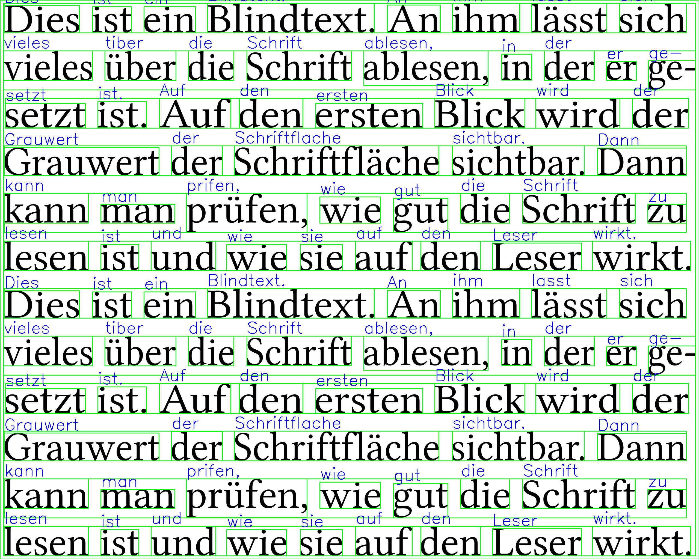

# OCR with Tesseract and OpenCV

Perform Optical Character Recognition (OCR) on images using Tesseract OCR engine with OpenCV preprocessing.

## Overview

This project provides a Python script to perform OCR on images using the Tesseract OCR engine with preprocessing done using OpenCV. It allows extracting text from images in various formats and provides options to display the processed image with bounding boxes around recognized text and save the output as a text file.

## Features

- **Preprocessing**: Uses OpenCV to preprocess the input image for better OCR accuracy.
- **Text Extraction**: Extracts text from images using Tesseract OCR engine.
- **Output Formatting**: Displays the recognized text and optionally the processed image with bounding boxes around recognized text.
- **Output Saving**: Saves the extracted text to a text file for further analysis or use.

## TODO: Implement live camera OCR option.
  
## Usage

### Installation

1. Clone the repository:

```bash
git clone https://github.com/real0x0a1/ocr-opencv.git
```

2. Install dependencies:

```bash
pip3 install -r requirements.txt
```

### Usage

1. Run the script `main.py`:

```bash
python main.py
```

2. Follow the prompts to provide the path to the image file and select options for display and output.

## Example

### Input Image


### Output



## Acknowledgements

- [Tesseract OCR](https://github.com/tesseract-ocr/tesseract)
- [OpenCV](https://github.com/opencv/opencv)

## Contributing

Contributions are welcome! Fork the repository and submit a pull request.

## Issues

Please open an issue on the GitHub repository for any bugs or feature requests.

## Author

real0x0a1 (Ali)

---
